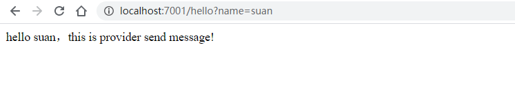
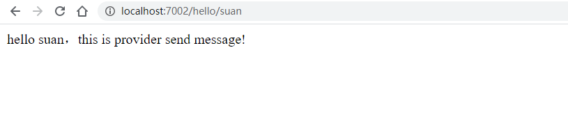
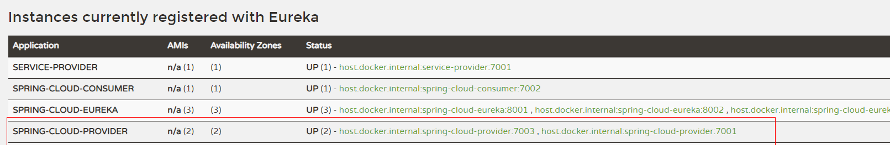

# 服务启动
## 启动注册中心
main方法运行EurekaServerApplication，如果需要进行集群，则每次指定profiles.active 的值为peer1、peer2、peer3即可
## 启动生产者服务
main方法运行ProviderApplication

## 启动消费者服务
main方法运行ConsumerApplication

## 验证
### 首先直接查看生产者是不是可用的
    http://localhost:7001/hello?name=suan 

说明生产者服务是可用的。

### 通过消费者服务远程调用生产者服务
    http://localhost:7002/hello/suan
 
说明消费者远程调用成功

## 生产者负载均衡
再提供一个消费者：这里只是简单的修改了
1、
  
    @RestController
    public class HelloController {
    
        @RequestMapping("/hello")
        public String hello(@RequestParam String name) {
            return "hello " + name + "，this is provider 2 send  message!";
        }
    }
    
2、修改 server.port 端口号 7003    

3、启动第二个生产者，我们可以看到现在注册中心中有两个生产者

## 再次测试消费者服务，查看结果
    http://localhost:7002/hello/suan
    
    第一次返回： hello suan，this is provider send message!  
    第二次返回： hello suan，this is provider 2 send message!  
  
