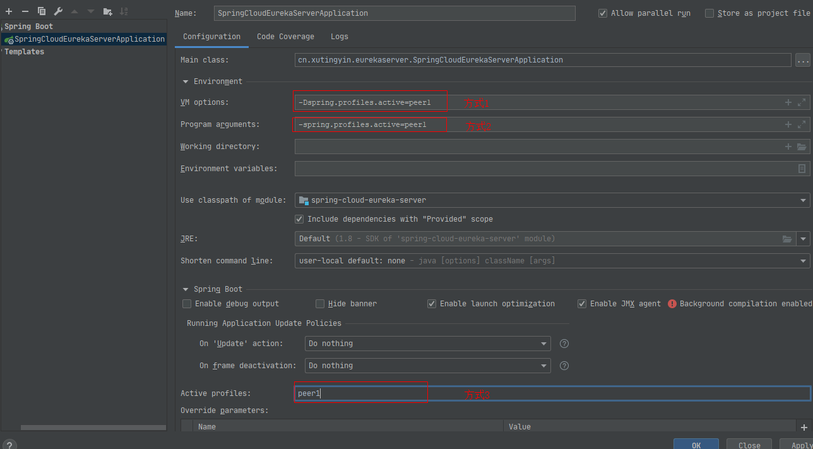
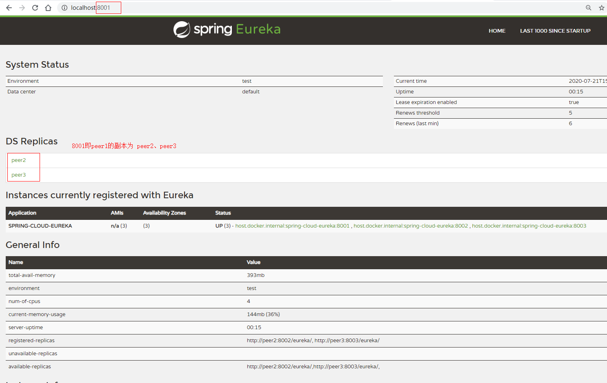
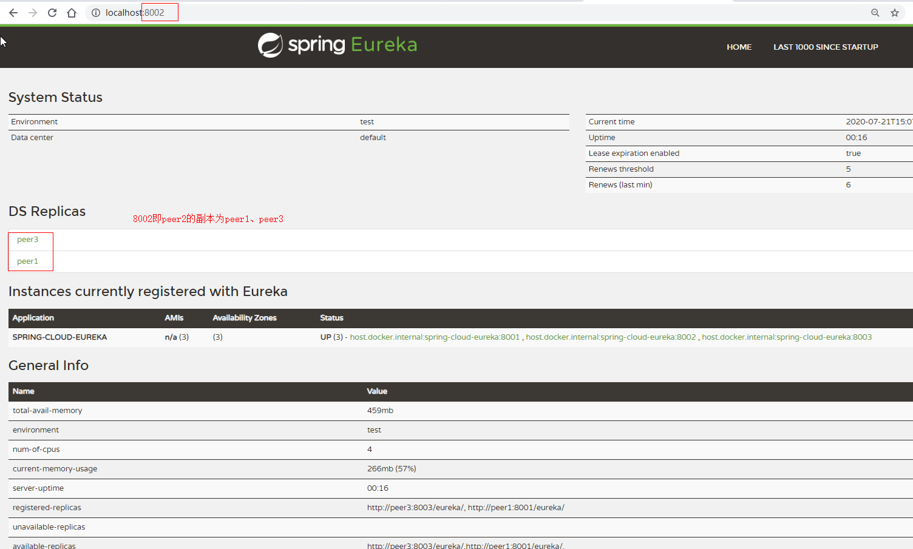
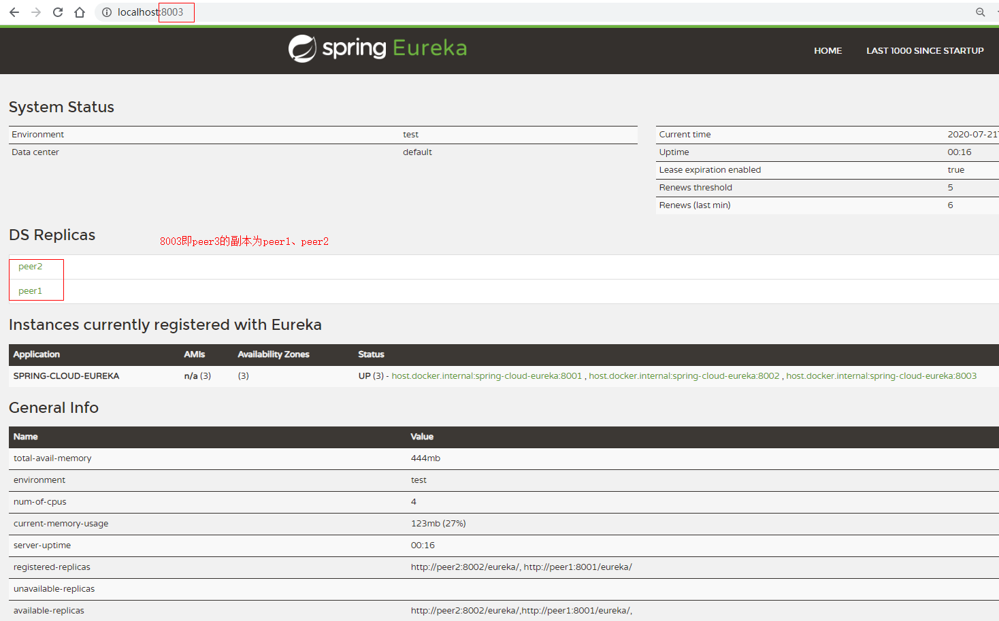

## 修改hosts

    127.0.0.1 peer1
    127.0.0.1 peer2
    127.0.0.1 peer3

注：hosts文件位置 linux环境:/etc/hosts;windows环境：C:\Windows\System32\drivers\etc\hosts

启动执行：分别以peer1、peer2、peer3 配置信息启动eureka

    java -jar spring-cloud-eureka-0.0.1-SNAPSHOT.jar --spring.profiles.active=peer1
    java -jar spring-cloud-eureka-0.0.1-SNAPSHOT.jar --spring.profiles.active=peer2
    java -jar spring-cloud-eureka-0.0.1-SNAPSHOT.jar --spring.profiles.active=peer3
    
或者利用IDEA 每次启动的时候指定
   

## 查看eureka集群

## eureka 基本结构

由三部分组成：

    1、Eureka Server： 提供服务注册和发现。    
    2、Service Provider：服务提供者，将自称服务注册到Eureka Server，从而使服务消费者能够找到。
    3、Service Consumer：服务消费者，从Eureka Server 中获取注册列表，消费服务。